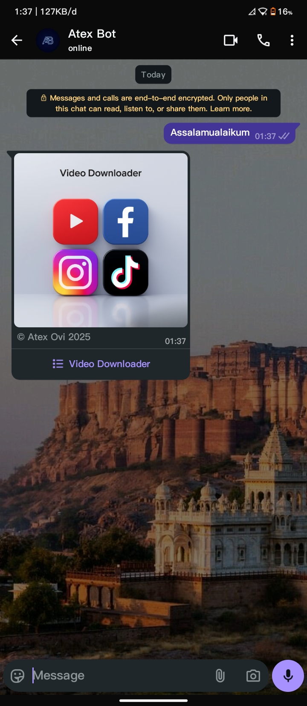
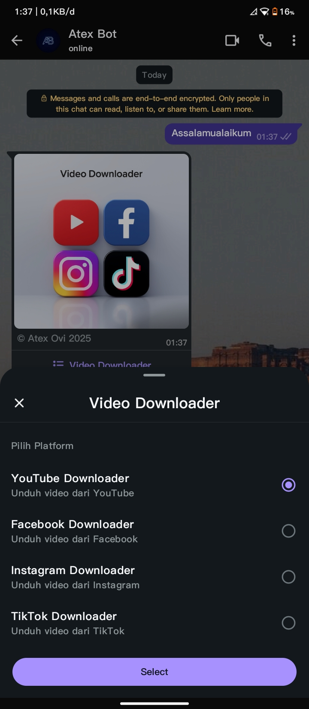
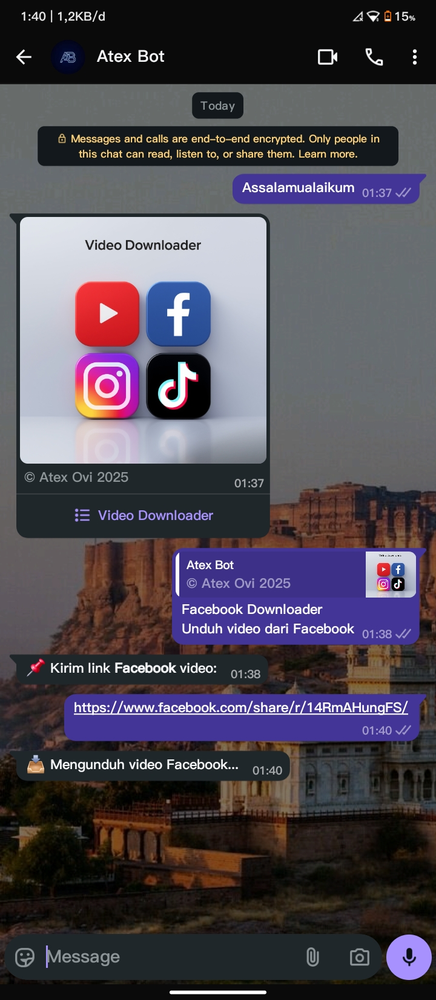
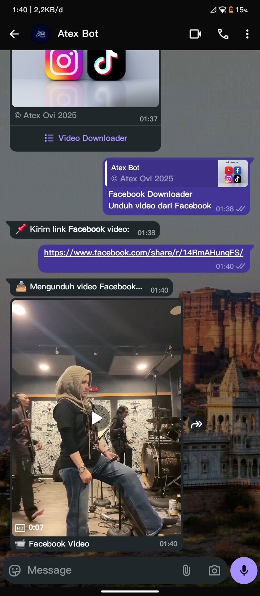

<h1 align="center" style="font-size:72px;">
  DownloaderX - WhatsApp Bot
</h1>
<br>

<p align="center">

  <!-- 🔹 BARIS 1 -->
  <a href="https://www.npmjs.com/package/atexovi-baileys" target="_blank">
    
  </a>
  <a href="https://nodejs.org/en/" target="_blank">
    
  </a>
  <a href="https://github.com/atex-ovi/DownloaderX/blob/main/LICENSE" target="_blank">
    
  </a>
  <a href="https://github.com/atex-ovi/DownloaderX/stargazers" target="_blank">
    
  </a>
  <a href="https://github.com/atex-ovi/DownloaderX/network/members" target="_blank">
    
  </a>

  <br>

  <!-- 🔹 BARIS 2 -->
  <a href="https://github.com/atex-ovi/DownloaderX/issues" target="_blank">
    
  </a>
  <a href="https://github.com/atex-ovi/DownloaderX/commits/main" target="_blank">
    
  </a>
  <a href="https://saweria.co/atexovi" target="_blank">
    
  </a>
  <a href="https://facebook.com/atex.ovi" target="_blank">
    
  </a>

</p>

<br>

<p align="center">
  
</p>

<p align="center">
  <strong style="font-size:24px;">
    DownloaderX is an interactive WhatsApp bot based on 
    <a href="https://www.npmjs.com/package/atexovi-baileys">atexovi-baileys</a>. 
    This bot provides a clean interface for downloading videos from multiple platforms.
  </strong>
</p>

<br>

## Features

<table>
  <tr>
    <td width="40"></td>
    <td style="font-size:20px;"><strong>YouTube Downloader</strong> – Download YouTube videos directly via WhatsApp</td>
  </tr>
  <tr>
    <td></td>
    <td style="font-size:20px;"><strong>Facebook Downloader</strong> – Download videos from Facebook links</td>
  </tr>
  <tr>
    <td></td>
    <td style="font-size:20px;"><strong>Instagram Downloader</strong> – Download Instagram media easily</td>
  </tr>
  <tr>
    <td></td>
    <td style="font-size:20px;"><strong>TikTok Downloader</strong> – Download TikTok videos without watermark</td>
  </tr>
</table>

<br>

## Demo / Screenshot

<table>
  <tr>
    <td></td>
    <td></td>
    <td></td>
    <td></td>
  </tr>
</table>

<br>

## ⚡ Quick Start / Installation

> [!NOTE]
> Follow these instructions to set up **DownloaderX** on Termux (Android), Windows, or Linux.

<br>

### 🧩 Prerequisites

Before installing, make sure your system has:

- **Node.js >= 20**  
  ```bash
  node -v
  ```
- **npm** (comes with Node.js)  
  ```bash
  npm -v
  ```
- **Git**  
  ```bash
  git --version
  ```
- Stable internet connection.

<br>

### 📱 Termux (Android)

1. Update and install dependencies:

```bash
pkg update && pkg upgrade
pkg install nodejs git
```

2. Clone the repository:

```bash
git clone https://github.com/atex-ovi/DownloaderX.git
cd DownloaderX
```

3. Install Node.js dependencies:

```bash
npm install
```

4. Run the bot:

```bash
npm start
```

> [!TIP]
> Follow the pairing code that appears in the terminal to connect WhatsApp.

<br>

### 🖥️ Windows / Linux

1. Install Node.js & Git  
   - Windows: [Node.js LTS](https://nodejs.org) and [Git](https://git-scm.com/download/win)  
   - Linux: `sudo apt install nodejs npm git`

2. Clone the repository:

```bash
git clone https://github.com/atex-ovi/DownloaderX.git
cd DownloaderX
```

3. Install dependencies:

```bash
npm install
```

4. Run the bot:

```bash
npm start
```

> [!NOTE]
> The `session/` folder will be created automatically to store authentication. Always follow the pairing code instructions in the terminal.

<br>

## 📌 Compatibility

<table>
  <tr>
    <th style="width:300px; text-align:left;">Platform</th>
    <th style="width:120px; text-align:left;">Status</th>
    <th style="width:400px; text-align:left;">Notes / Recommendation</th>
  </tr>
  <tr>
    <td style="min-width:300px;">
      <div style="display:flex; align-items:center; gap:8px;">
        
        <span>WhatsApp Messenger</span>
      </div>
    </td>
    <td>✅ Stable</td>
    <td>Recommended for clean usage, no extra logs</td>
  </tr>
  <tr>
    <td style="min-width:300px;">
      <div style="display:flex; align-items:center; gap:8px;">
        
        <span>WhatsApp Business</span>
      </div>
    </td>
    <td>⚠️ Works normally</td>
    <td>May display internal session/debug logs</td>
  </tr>
</table>

<br>

## 📂 Directory Structure

```
DownloaderX/
├── LICENSE
├── README.md
├── SECURITY.md
├── index.js
├── package.json
└── src
    ├── assets
    │   └── menu.jpg         # Image used for the main menu
    ├── features
    │   ├── facebook.js      # Facebook downloader logic
    │   ├── instagram.js     # Instagram downloader logic
    │   ├── tiktok.js        # TikTok downloader logic
    │   └── youtube.js       # YouTube downloader logic
    ├── handler.js           # Main message handler
    ├── userState.js         # Stores user session states
    └── utils
        ├── typing.js        # Wrapper for sendMessage with typing simulation
        └── validateUrl.js   # URL validation utility
```

> [!TIP]
> You can customize each feature module or add new downloaders by following the existing module pattern.

<br><br>

> [!CAUTION]
> WhatsApp is a trademark of WhatsApp Inc.
> 
> This bot uses the [**atexovi-baileys**](https://www.npmjs.com/package/atexovi-baileys) library, which is open-source and unofficial.
> 
> Use this bot at your own risk and avoid spam or abuse.

<br>

## Special Thanks
- [WhatsApp API](https://www.whatsapp.com) - WhatsApp's official messaging technology.
- [adiwajshing (Baileys)](https://github.com/adiwajshing) - Baileys library developer for WhatsApp API.
- [WhiskeySockets Baileys](https://github.com/WhiskeySockets) - additional contributions to Baileys.

<br>

## Support & Donations
If you find this project useful, consider supporting the development:

[](https://saweria.co/atexovi)

<br>

## License

This project is licensed under the [MIT License](LICENSE).
